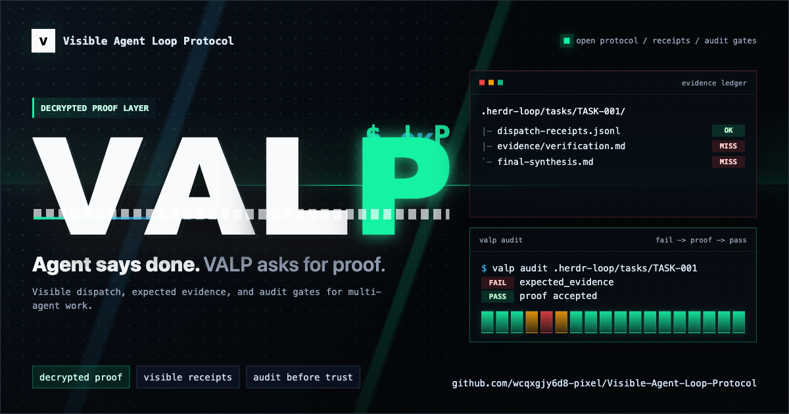

# Visible Agent Loop Protocol

Open protocol for visible, evidence-backed, multi-agent automation.

[](https://github.com/wcqxgjy6d8-pixel/Visible-Agent-Loop-Protocol/actions/workflows/verify.yml)



Languages: [English](README.md) | [中文](README.zh-CN.md)

中文注解入口: [README.zh-CN.md](README.zh-CN.md) and
[docs/zh-CN/README.md](docs/zh-CN/README.md). The Chinese pages are
explanatory notes; `SPEC.md` and `schemas/` remain the normative protocol
source.

The protocol is designed for terminal-based AI coding agents, review agents,
research agents, prototype agents, and coordinator agents. It is not tied to a
single project, operating system, terminal emulator, or model provider.

## Current Status

VALP is a `0.2.0` open protocol release plus an MIT-licensed reference CLI. It
is not a mature hosted platform and should not be described as production-ready
by itself.

What this repository proves today:

- schemas, unit tests, and bundled examples pass `scripts/verify-examples.sh`;
- CI runs the repository smoke check on Linux, macOS, and Windows runners;
- `valp audit` enforces receipt, evidence, review, agent-recommendation,
  approval, and final synthesis gates for the included task folders.

What it does not prove yet:

- a public live Full Mode case study using a runtime end to end;
- first-class non-HERDR runtime adapters beyond the synthetic queue fixture;
- native Full Mode guarantees on every local operating system;
- production deployment reliability for a third-party runtime.

HERDR is the current reference runtime for the automated path. It has a public
source repository, currently documented at
<https://github.com/ogulcancelik/herdr>, but VALP completion semantics do not
depend on HERDR specifically. See [docs/project-status.md](docs/project-status.md)
for the current evidence and gap matrix.

## Why VALP?

Agent work often fails in ways that ordinary chat transcripts hide:

- an agent says "done" without evidence;
- text is inserted into an input box but never submitted;
- a runtime marks a job completed before expected files exist;
- a reviewer gives a hidden opinion that the user cannot audit;
- a local preference silently turns into a fixed leader assignment.

VALP turns those failure points into a protocol: visible dispatches, receipt
states, expected evidence, review gates, approval gates, and final synthesis.
It is closer to a control system than a chat convention.

VALP is not a model ensemble or hidden consensus method. A model-level system
such as Hermes Mixture of Agents (MoA) can improve one acting model's reasoning
by collecting reference-model advice before the acting model responds. VALP
governs multi-agent task execution: which runtime or agent was routed, what was
dispatched, what evidence was expected, what actually completed, and whether
the work passed review and audit.

## Entry Paths

Choose the path that matches why you are here:

| Goal | Start here | Runtime required? |
|---|---|---|
| Understand the protocol | Read [SPEC.md](SPEC.md) and audit `examples/minimal-task/` | No |
| Try automated multi-agent work | Install HERDR, the current reference runtime | Yes |
| Enable automatic visible task intake | Read [docs/auto-visible-mode.md](docs/auto-visible-mode.md) | For dispatch, yes |
| Inspect a headless runtime shape | Audit `examples/headless-queue-task/` | No |
| See what failures VALP catches | Read [docs/failure-gallery.md](docs/failure-gallery.md) | No |
| Implement a new runtime | Read [docs/adapter-checklist.md](docs/adapter-checklist.md) and [docs/runtime-adapters.md](docs/runtime-adapters.md) | Depends on your adapter |

## Community

VALP is most useful when people bring real workflow failures and concrete
runtime evidence. The project is looking for:

- runtime adapter feedback from queues, hosted agent systems, terminal
  controllers, and manual review workflows;
- small audited examples that show where visible receipts help or fail;
- RFCs for protocol, evidence, schema, adapter, or governance changes;
- documentation improvements that make first install and first audit easier;
- skeptical critiques of whether the protocol is useful or just ceremony.

Start with [docs/community.md](docs/community.md), open-ended feedback in
[GitHub Discussions](https://github.com/wcqxgjy6d8-pixel/Visible-Agent-Loop-Protocol/discussions),
or scoped tasks in
[good first issues](https://github.com/wcqxgjy6d8-pixel/Visible-Agent-Loop-Protocol/issues?q=is%3Aissue%20is%3Aopen%20label%3A%22good%20first%20issue%22).
For support routing, see [SUPPORT.md](SUPPORT.md).

The best early feedback is not a generic "looks good". It is one of:

- a false-done case where an agent or runtime claimed completion without proof;
- a minimal audit run that failed or felt too ceremonial;
- a runtime-adapter sketch that preserves receipt and evidence semantics.
- an RFC that proposes the smallest evidence-changing protocol improvement.

No-runtime first look:

```bash
git clone https://github.com/wcqxgjy6d8-pixel/Visible-Agent-Loop-Protocol.git
cd Visible-Agent-Loop-Protocol
python -m pip install -r requirements-dev.txt
bin/valp audit examples/minimal-task
```

Expected result:

```text
VALP audit: PASS
Summary: pass=13 warn=0 fail=0 skip=7
```

To see the audit fail when expected evidence is removed, run the
[minimal audit demo](docs/minimal-audit-demo.md). This is the fastest way to
understand the protocol's acceptance-system behavior before trying a live
runtime.

Proof check for this repository:

```bash
python -m pip install -r requirements-dev.txt
scripts/verify-examples.sh
```

That script requires Bash, Python, and the Python `jsonschema` package. It
validates JSON examples against schemas, runs the unit tests, then audits the
bundled examples. The same check runs in GitHub Actions on Linux, macOS, and
Windows runners for push and pull request.

Editable local CLI install for development:

```bash
python -m pip install -e ".[dev]"
valp audit examples/minimal-task
```

Reference-runtime trial:

```bash
bin/valp publish TASK-001 --workspace /path/to/workspace --prompt "Fix the bug and verify it"
bin/valp dispatch TASK-001 --workspace /path/to/workspace
```

`publish` only creates and routes the task. It is not a completion signal. A
new task will not pass `valp audit` until dispatch receipts, expected evidence,
verification/review status, and final synthesis are recorded.

For Full Mode claims, completed receipts must be backed by actual runtime
submission proof for each selected agent. Dry-run dispatch output, local
sub-agent analysis, or a manually appended `dispatch_completed` receipt is not
HERDR/live agent proof.

Generated dispatches are concise worker assignments. The coordinator or leader
is responsible for sending the short task brief, role, boundaries, expected
evidence, visible attention slice, and refs to full task evidence. Long context,
full task history, and detailed skill recommendation records should stay in
task-local files such as `task.md` and `skill-recommendations.json`.

Auto Visible Mode is the opt-in version of this entry path: a local policy or
runtime watcher can decide that a user request should publish a VALP task
without requiring the user to type the exact command. It must still show the
trigger reason, task id, routing, skill recommendations, dispatches, evidence
gates, and final report. Automatic trigger is not permission for silent
high-risk execution.

## Architecture

```text
user request
  -> VALP task folder
  -> reference CLI or compatible runtime adapter
  -> agent sessions, queues, hosted runs, or manual handoffs
  -> dispatch receipts
  -> expected evidence
  -> verification/review/approval gates
  -> final synthesis
  -> valp audit
```

HERDR is the current reference runtime for the automated path. It is not the
protocol itself.

For a visual sequence diagram, see [docs/visual-flow.md](docs/visual-flow.md).

## Runtime Vs Terminal

A terminal app is not enough to provide VALP Full Mode.

Terminal apps such as Windows Terminal, Ghostty, iTerm, Apple Terminal, and
Linux terminal emulators can display multiple agent sessions. Some terminals can
also open split panes from the command line. That helps visibility, but it is
not the same as a runtime adapter.

Full Mode still requires a control layer that can prove:

- which agent received a dispatch;
- whether the dispatch was submitted, not only inserted as text;
- which expected evidence appeared;
- how timeouts, blocked work, and late evidence were recorded;
- whether approval, review, and final synthesis gates passed.

HERDR currently provides that control layer as the reference runtime. A
no-HERDR Windows path can still be VALP-compatible, but it should use a
runner/queue adapter that writes receipts and evidence. It should not rely on
fragile keystroke automation into terminal panes as Full Mode proof.

## Fast Start

VALP's default automated path is Full Mode with HERDR, the current reference
runtime. The protocol supports other compatible runtimes, and this repository
also includes a synthetic headless queue example for adapter authors.

Recommended first path:

```text
1. Install VALP and resolve the actual install root.
2. Run `valp doctor` before any real dispatch.
3. Install HERDR, the reference VALP runtime, when Full Mode is desired.
4. Run runtime preflight for the selected agents.
5. Create or choose a workspace.
6. Publish and dispatch a dry-run task first.
7. Let the runtime scan agents, dispatch visibly, wait for status, and write
   receipts/evidence.
```

Linux/macOS recommended HERDR install:

```bash
curl -fsSL https://herdr.dev/install.sh | sh
herdr status
```

See [INSTALL.md](INSTALL.md) for Homebrew, Windows, SSH remote, and fallback
paths.

App-managed installs should follow the same order: install check, doctor,
runtime preflight, dry-run publish/dispatch, user opt-in, then optional live
smoke test. New installs should not enable `--submit`, `policy_auto`, or watcher
mode before the user has seen doctor/preflight results.

New users should start with [docs/quickstart.md](docs/quickstart.md).

## Reference CLI

VALP 0.2 starts with a local coordinator workflow plus an executable quality
gate:

```bash
bin/valp publish TASK-001 --workspace /path/to/workspace --prompt "Fix the bug and verify it"
bin/valp doctor --workspace /path/to/Visible-Agent-Loop-Protocol
bin/valp preflight --runtime herdr --agent agy
bin/valp dispatch TASK-001 --workspace /path/to/workspace
bin/valp audit examples/full-mode-task
```

`valp publish` creates the task, scans local capabilities when available, routes
selected agents, writes dispatch files, and records `dispatch_written` receipts.
The current reference scan reads VALP-local capability files first, then
HERDR-compatible files as a compatibility fallback. If no local capability file
is available, it falls back to a generic Manual Mode operator record rather than
assuming a specific AI agent is installed.

`valp preflight` checks adapter-specific runtime readiness such as agent
sessions, terminal size for pane adapters, queue/worker facts for headless
adapters, CLI version probes, and restart/update signals when the adapter can
expose them.

`valp dispatch` prints Manual Mode copy instructions for manual tasks, HERDR
adapter submit commands for pane-controller tasks, or queue enqueue
instructions for headless queue tasks. Use `--submit` only when the selected
runtime is ready.

`valp audit` scans a task evidence folder and checks the Done Criteria from
`SPEC.md`, including runtime preflight, skill recommendation evidence,
correction-cycle evidence, invalid evidence status, and unsupported
runtime/build/test claims.

`valp doctor` diagnoses a VALP protocol checkout without mutating by default. It
checks local git tracking status, working tree cleanliness, ignored local
residue, JSON/JSONL syntax, bundled example audits, and reference adapter
probes. Use
`--report <path>` or `--report desktop` to write a Markdown report.

See [docs/cli-audit.md](docs/cli-audit.md).

## Proof It Works

The repository includes four self-verifying task examples:

| Example | What it proves | Expected audit |
|---|---|---|
| `examples/minimal-task/` | Manual Mode evidence can be audited without a runtime | `PASS`, `pass=13 warn=0 fail=0 skip=7` |
| `examples/full-mode-task/` | Synthetic Full Mode fixture satisfies runtime, receipt, correction-cycle, recommendation, review, and final synthesis audit gates | `PASS`, `pass=19 warn=0 fail=0 skip=1` |
| `examples/headless-queue-task/` | Synthetic Full Mode queue fixture passes without pane or terminal-size fields | `PASS`, `pass=18 warn=0 fail=0 skip=2` |
| `examples/real-doc-calibration-task/` | Sanitized real Manual Mode documentation calibration case study | `PASS`, `pass=14 warn=0 fail=0 skip=6` |

Run the complete smoke check:

```bash
scripts/verify-examples.sh
```

This is repository evidence, not a platform-support claim. It proves the CLI,
schemas, unit tests, and bundled examples pass on the machine running the check.
The GitHub workflow runs this proof on Linux, macOS, and Windows runners. It
does not launch HERDR or prove live agent dispatch. Full Mode on a user machine
still depends on a compatible runtime adapter such as HERDR or another adapter
that exports VALP receipts and evidence.

## Platform Paths

| User system | Recommended path | Mode | Caveat |
|---|---|---|---|
| macOS | HERDR stable installer or Homebrew | Full Mode | Reference runtime path |
| Linux | HERDR stable installer, manual binary, or package manager | Full Mode | Reference runtime path |
| Windows stable workflow | SSH to Linux/macOS host running HERDR | Remote Mode | Full Mode guarantees live on the remote host |
| Windows local workflow | HERDR Windows preview beta | Conditional Full Mode | Verify beta limitations before claiming Full Mode |
| Windows without HERDR | Manual Mode today; runner/queue adapter implementation required for Full Mode | Manual / adapter-specific | Windows Terminal can display panes, but does not itself provide receipts |
| No compatible runtime | Manual files and evidence only | Manual Mode | Useful for learning and audit trails; no runtime proof |

See [docs/platform-support.md](docs/platform-support.md) for platform-specific
notes.

## What Full Mode Provides

Full Mode is the intended VALP experience for automated multi-agent work:

- automatic agent and runtime scan;
- provider matrix and context policy scan;
- visible dispatch;
- submission proof;
- status wait;
- receipt ledger;
- evidence gates;
- review/fix/review loop;
- selected-agent recommendation resolution;
- approval gates for high-risk actions;
- final synthesis record.

Manual Mode is a valid way to learn or adopt the evidence discipline before a
runtime is installed. It can preserve task folders, manual dispatch records, and
evidence notes, but it must not claim automatic dispatch proof, status waits, or
runtime-backed receipt guarantees.

## Core Idea

Visible Agent Loop is a control system, not a chat convention:

```text
publish task
  -> scan runtime, tools, skills, context budgets
  -> load local overlay, if present
  -> select runtime adapter
  -> classify task profile
  -> build provider matrix
  -> preflight runtime and agent sessions
  -> score and route agents by evidence
  -> run skill recommendation, if available
  -> route squad if needed
  -> dispatch visibly
  -> require receipts
  -> map runtime task states
  -> verify with real artifacts
  -> review/fix/review
  -> resolve selected-agent recommendations with scope control
  -> record final synthesis
```

No agent is assumed to be known from memory. Agent selection is based on current
runtime evidence: declared role, installed skills, available MCP/tools, runtime
status, adapter preflight, permission boundary, context policy, optional skill
recommendation evidence, local overlay hints, prior verification records, and
routing feedback.
Local capability profiles are hints, not fixed assignments. Every task reruns
capability routing.

Managed-agent platforms, daemon queues, and terminal-pane systems can all be
VALP-compatible if they export the required runtime adapter evidence. A runtime
task marked "completed" is not enough by itself; VALP completion still requires
receipts and expected evidence.

## Modes

| Mode | Runtime requirement | Guarantees |
|---|---|---|
| Auto Visible Mode | opt-in trigger policy plus Full/Remote/Manual execution path | automatic visible intake, trigger evidence, routing, skill recommendation, report refs |
| Full Mode | HERDR reference runtime or compatible runtime | agent scan, visible dispatch, submission proof, status waits, receipt ledger, evidence gates |
| Remote Mode | SSH to a VALP-compatible runtime | same as Full Mode, with remote runtime caveats |
| Manual Mode | no runtime automation | task folders, manual attestations, and evidence files; no automatic dispatch proof |

Terminal apps such as Ghostty, iTerm, Apple Terminal, Windows Terminal, or a
Linux terminal are display shells. The protocol requires runtime capabilities,
not a specific terminal emulator.

## Runtime Compatibility

HERDR is the reference runtime. Public HERDR documentation currently describes
stable Linux/macOS support and Windows preview beta support, and the public
source repository is linked from [docs/project-status.md](docs/project-status.md).
Runtime support can change; check current runtime documentation before
publishing platform claims.

Reference: https://herdr.dev/

See [INSTALL.md](INSTALL.md) for the recommended installation paths.

The protocol itself only requires a VALP-compatible runtime interface:

```text
agent list
agent status/read
agent send/insert
agent session/message submit
submission proof
status wait
task evidence store
receipt ledger
```

## Repository Layout

```text
Visible-Agent-Loop-Protocol/
  README.md
  README.zh-CN.md
  SPEC.md
  INSTALL.md
  ROADMAP.md
  bin/
    valp
  valp_cli/
    audit.py
  LICENSE
  CHANGELOG.md
  CONTRIBUTING.md
  SUPPORT.md
  SECURITY.md
  PRIVACY.md
  docs/
    runtime.md
    cli-audit.md
    doctor.md
    auto-visible-mode.md
    runtime-preflight.md
    platform-support.md
    quickstart.md
    faq.md
    comparison.md
    failure-gallery.md
    adapter-checklist.md
    runtime-adapters.md
    community.md
    project-status.md
    schema-versioning.md
    task-state-machine.md
    troubleshooting.md
    local-overlays.md
    intelligent-routing.md
    provider-matrix.md
    squad-routing.md
    workspace.md
    capability-routing.md
    context-compression.md
    dispatch-receipts.md
    skill-recommendation.md
    routing-feedback.md
    profiles.md
    manual-mode.md
  schemas/
    capabilities.schema.json
    local-overlay.schema.json
    routing-feedback.schema.json
    state.schema.json
    routing.schema.json
    receipts.schema.json
    evidence-status.schema.json
    skill-recommendations.schema.json
    agent-recommendations.schema.json
    trigger-policy.schema.json
    attention-map.schema.json
    context-selection.schema.json
    mask-list.schema.json
    evidence-board.schema.json
  examples/
    task-folder-tree.md
    context-policy.json
    routing.json
    trigger-policy.json
    dispatch.md
    minimal-task/
    full-mode-task/
    headless-queue-task/
    real-doc-calibration-task/
```

## Non-Negotiables

- No hidden agent judgment as decision input.
- No fake success.
- Text inserted into an input box is not delivery.
- Dispatch completion requires receipts and expected evidence.
- Full/Remote Mode completion also requires prior runtime submission proof; dry
  runs and local sub-agent simulations do not count as live dispatch.
- Selected-agent recommendations must be visibly resolved; adoption means
  explicit disposition and scope control, not unlimited task expansion.
- Dispatch payloads must be concise; long context and full recommendation
  records are cited by file reference, not pasted into every worker prompt.
- High-risk actions require explicit user approval.
- Auto Visible Mode is automatic visible intake, not silent execution.
- Long context is a reliability risk and must be scanned before dispatch.
- Skill recommendation is evidence, not authority.
- Local overlays are hints, not protocol overrides.
- Agent profiles are routing hints, not fixed assignments.
- Provider capability is scanned, not assumed.
- Routing feedback improves future routing but never replaces current scans.
- Runtime queue completion is not VALP completion unless evidence gates pass.
- Squad routing is visible routing evidence, not hidden agent judgment.
- Profiles adapt the protocol to domains; projects are inputs, not protocol
  centers.

## Status

Open protocol draft with reference CLI version `0.2.0`. The protocol draft is
released as `v0.2.0`; HERDR remains the current reference runtime, not a
protocol requirement.
