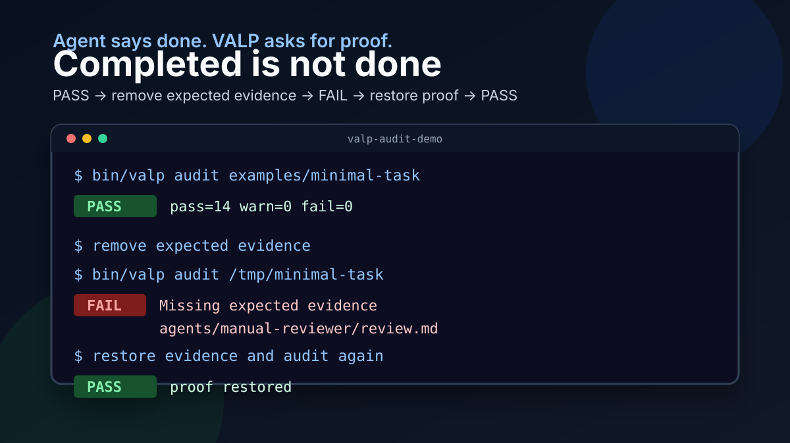

# Visible Agent Loop Protocol

Agent says done. VALP asks for proof.

[](https://github.com/wcqxgjy6d8-pixel/Visible-Agent-Loop-Protocol/actions/workflows/verify.yml)


VALP is an open protocol and reference CLI for visible, evidence-backed
autonomous and multi-agent work. It catches false completion by checking
automation policy, dispatch receipts, expected evidence, review/approval gates,
final synthesis, and task-local learning feedback.

Try the smallest audit path:

```bash
git clone https://github.com/wcqxgjy6d8-pixel/Visible-Agent-Loop-Protocol.git
cd Visible-Agent-Loop-Protocol
python -m pip install -r requirements-dev.txt
bin/valp audit examples/minimal-task
```



For automated Full Mode, [HERDR](https://github.com/ogulcancelik/herdr) is the
current reference runtime. HERDR is not required by the protocol; any runtime
can be VALP-compatible when it exports the required receipts and evidence.

Languages: [English](README.md) | [中文](README.zh-CN.md)

中文注解入口: [README.zh-CN.md](README.zh-CN.md) and
[docs/zh-CN/README.md](docs/zh-CN/README.md). The Chinese pages are
explanatory notes; `SPEC.md` and `schemas/` remain the normative protocol
source.

The protocol is designed for terminal-based AI coding agents, review agents,
research agents, prototype agents, and coordinator agents. It is not tied to a
single project, operating system, terminal emulator, or model provider.

## Current Status

VALP source defines a locally stable `0.3.0` protocol and MIT-licensed reference
CLI. This checkout is a local publication candidate; GitHub push, review, merge,
tag, and release remain pending. It is not a mature hosted platform and should
not be described as production-ready by itself.

What this repository proves today:

- schemas, unit tests, and bundled examples pass `scripts/verify-examples.sh`;
- CI runs the repository smoke check on Linux, macOS, and Windows runners;
- `valp audit` enforces receipt, evidence, automation-policy, context-pack,
  review, agent-recommendation, approval, learning-feedback, and final
  synthesis gates for the included task folders;
- a short [visible dispatch process proof](docs/case-studies/visible-dispatch-process-proof.md)
  shows a real VALP/HERDR publish-and-dispatch run;
- a [real LangGraph false-done case](docs/case-studies/langgraph-false-done.md)
  preserves runtime success with missing evidence, repair, independent review,
  and a final `fail_count=0` audit.

What it does not prove yet:

- a production-hosted LangGraph or agent-provider deployment;
- deterministic coordinator auto-continuation across runtime restart;
- native Full Mode guarantees on every local operating system;
- production deployment reliability for a third-party runtime.

## Open Core And Commercial Delivery

This repository is the MIT-licensed open core: the protocol, reference CLI,
schemas, adapter contracts, examples, and tests are public for inspection and
self-hosted use. Enterprise installation and migration, private integrations,
hosted operation, monitoring, compliance work, and support are separate
commercial delivery layers and are not bundled with this repository. No
customer data, credentials, local control roots, or deployment secrets belong
here. See the [open-core and commercial boundary](docs/open-source-commercial-boundary.md)
for the exact boundary.

The practical value is not a claim that VALP bundles 223 skills. Skills come
from the connected Agent/runtime environment. Doctor inventories which skills
each Agent can actually reach; the user-selected Leader assigns work; VALP
matches relevant skills to each work item and gives each Worker a filtered
dispatch slice; the Worker then loads, uses, or explicitly declines the skill
and returns evidence. Read [how skill discovery and Worker use work](docs/skill-recommendation.md)
for the complete chain.

HERDR is the current reference runtime for the automated path. It has a public
source repository, currently documented at
<https://github.com/ogulcancelik/herdr>, but VALP completion semantics do not
depend on HERDR specifically. See [docs/project-status.md](docs/project-status.md)
for the current evidence and gap matrix.

## v0.3.0 Protocol And Reference CLI

The stable protocol and reference CLI are `0.3.0`. RFC 0001 is accepted and
its installation-control-plane semantics are incorporated into `SPEC.md`, the
schemas, and the reference CLI. Read the [implementation guide](docs/v0.3-implementation.md)
and the [accepted RFC](docs/rfcs/0001-v0.3-installation-control-plane.md).

In Software 3.0 terms, VALP is control-plane code around work driven by prompts,
tools, and agents. It does not make a model smarter. It makes control decisions
and completion claims inspectable. `0.2.0` established the task-level evidence
discipline; `0.3.0` extends it to a restart-safe, provider-neutral, testable
installation control plane.

The `0.3.0` core adds:

- a user-selected **Installation Leader**, constrained by a deterministic core
  and fenced leader epochs rather than a hard-coded universal coordinator;
- an authoritative persistent capability registry that keeps
  `official_claim`, `local_presence`, `live_callable`, and `task_verified` as
  separate evidence layers;
- strict contracts for messages, executable state, claim-to-evidence binding,
  deterministic failure, and independent exact-artifact review;
- provider-neutral plugin manifest validation, explicit legacy migration plans,
  and a core conformance runner with negative and recovery tests.

The stable designation applies to the protocol and reference CLI, not to every
runtime, provider, platform, or production deployment. Adapter and platform
claims remain limited to the concrete evidence in the project status matrix;
unsupported production reliability is not implied by the release.

Read the [full RFC](docs/rfcs/0001-v0.3-installation-control-plane.md) and the
[current evidence matrix](docs/project-status.md) side by side: one describes
the accepted contract, and the other describes what this repository proves now.

## Why VALP?

Agent work often fails in ways that ordinary chat transcripts hide:

- an agent says "done" without evidence;
- text is inserted into an input box but never submitted;
- a runtime marks a job completed before expected files exist;
- a reviewer gives a hidden opinion that the user cannot audit;
- a local preference silently turns into a fixed leader assignment.

VALP turns those failure points into a protocol: visible dispatches, receipt
states, expected evidence, review gates, approval gates, and final synthesis.
It is closer to a control system than a chat convention.

VALP is not a model ensemble or hidden consensus method. A model-level system
such as Hermes Mixture of Agents (MoA) can improve one acting model's reasoning
by collecting reference-model advice before the acting model responds. VALP
governs multi-agent task execution: which Leader the user selected, which
Agents that Leader declared, what was dispatched, what evidence was expected,
what actually completed, and whether the work passed review and audit. VALP
does not choose or replace Agents.

## Entry Paths

Choose the path that matches why you are here:

| Goal | Start here | Runtime required? |
|---|---|---|
| Understand the protocol | Read [SPEC.md](SPEC.md) and audit `examples/minimal-task/` | No |
| Try the v0.3.0 installation control plane | Read [the implementation guide](docs/v0.3-implementation.md) | No |
| Review the v0.3 installation control plane | Read [RFC 0001](docs/rfcs/0001-v0.3-installation-control-plane.md) | No |
| Understand the automation and learning principles | Read [Compound Learning Loop](docs/compound-learning-loop.md) | No |
| See the shortest public demo | Read [When Agent "Done" Is Not Done](docs/when-agent-done-is-not-done.md) | No |
| Watch live dispatch process proof | Watch the [visible dispatch process proof](docs/case-studies/visible-dispatch-process-proof.md) | No |
| Try automated multi-agent work | Install HERDR, the current reference runtime | Yes |
| Enable automatic visible task intake | Read [docs/auto-visible-mode.md](docs/auto-visible-mode.md) | For dispatch, yes |
| Inspect a headless runtime shape | Audit `examples/headless-queue-task/` | No |
| See what failures VALP catches | Read [docs/failure-gallery.md](docs/failure-gallery.md) | No |
| Implement a new runtime | Read [docs/adapter-checklist.md](docs/adapter-checklist.md) and [docs/runtime-adapters.md](docs/runtime-adapters.md) | Depends on your adapter |

## Community

VALP is most useful when people bring real workflow failures and concrete
runtime evidence. The project is looking for:

- runtime adapter feedback from queues, hosted agent systems, terminal
  controllers, and manual review workflows;
- small audited examples that show where visible receipts help or fail;
- RFCs for protocol, evidence, schema, adapter, or governance changes;
- documentation improvements that make first install and first audit easier;
- skeptical critiques of whether the protocol is useful or just ceremony.

Start with [docs/community.md](docs/community.md), open-ended feedback in
[GitHub Discussions](https://github.com/wcqxgjy6d8-pixel/Visible-Agent-Loop-Protocol/discussions),
or scoped tasks in
[good first issues](https://github.com/wcqxgjy6d8-pixel/Visible-Agent-Loop-Protocol/issues?q=is%3Aissue%20is%3Aopen%20label%3A%22good%20first%20issue%22).
For support routing, see [SUPPORT.md](SUPPORT.md).

Active cold-start discussions:

- [RFC: Phase 0 public evaluation](https://github.com/wcqxgjy6d8-pixel/Visible-Agent-Loop-Protocol/discussions/8)
- [Runtime adapter checklist feedback](https://github.com/wcqxgjy6d8-pixel/Visible-Agent-Loop-Protocol/discussions/9)

Good first GitHub-native tasks:

- [Run the adapter checklist against one runtime](https://github.com/wcqxgjy6d8-pixel/Visible-Agent-Loop-Protocol/issues/10)
- [Add one false-done case to the failure gallery](https://github.com/wcqxgjy6d8-pixel/Visible-Agent-Loop-Protocol/issues/11)
- [Improve the Pages demo for Agent done is not done](https://github.com/wcqxgjy6d8-pixel/Visible-Agent-Loop-Protocol/issues/12)

The best early feedback is not a generic "looks good". It is one of:

- a false-done case where an agent or runtime claimed completion without proof;
- a minimal audit run that failed or felt too ceremonial;
- a runtime-adapter sketch that preserves receipt and evidence semantics.
- an RFC that proposes the smallest evidence-changing protocol improvement.

No-runtime first look:

```bash
git clone https://github.com/wcqxgjy6d8-pixel/Visible-Agent-Loop-Protocol.git
cd Visible-Agent-Loop-Protocol
python -m pip install -r requirements-dev.txt
bin/valp audit examples/minimal-task
```

Expected result:

```text
VALP audit: PASS
Summary: pass=13 warn=0 fail=0
```

To see the audit fail when expected evidence is removed, run the
[minimal audit demo](docs/minimal-audit-demo.md). This is the fastest way to
understand the protocol's acceptance-system behavior before trying a live
runtime.

For a shorter public-facing explanation, read
[When Agent "Done" Is Not Done](docs/when-agent-done-is-not-done.md).

Proof check for this repository:

```bash
python -m pip install -r requirements-dev.txt
scripts/verify-examples.sh
```

That script requires Bash, Python, and the Python `jsonschema` package. It
validates JSON examples against schemas, runs the unit tests, then audits the
bundled examples. The same check runs in GitHub Actions on Linux, macOS, and
Windows runners for push and pull request.

Editable local CLI install for development:

```bash
python -m pip install --upgrade pip setuptools
python -m pip install -e ".[dev]"
valp audit examples/minimal-task
```

Reference-runtime trial:

```bash
bin/valp doctor --workspace /path/to/workspace --json
bin/valp publish TASK-001 --workspace /path/to/workspace --prompt "Fix the bug and verify it"
bin/valp route TASK-001 --workspace /path/to/workspace \
  --assignments /path/to/assignment-declaration.json
bin/valp dispatch TASK-001 --workspace /path/to/workspace
```

Doctor commissions one capability passport per addressable Agent
surface/session. Each passport separates official claims, local presence, live
callability, and task-verified history, and records the observed model,
provider, reasoning mode, session identity, skills, MCP, permissions, context,
and limitations. The user chooses the Leader from those facts. `publish` only
creates the task. The Leader then writes `assignment-declaration.json`, and
`route --assignments` validates the declaration without choosing or replacing
any Agent. See [examples/assignment-declaration.json](examples/assignment-declaration.json).

A new task will not pass `valp audit` until the Leader declaration and VALP
validation agree, dispatch receipts and expected evidence exist,
verification/review status is resolved, and final synthesis and required
feedback records are recorded.

For Full Mode claims, completed receipts must be backed by actual runtime
submission proof for each Leader-declared Agent. Dry-run dispatch output, local
sub-agent analysis, or a manually appended `dispatch_completed` receipt is not
HERDR/live agent proof.

Generated dispatches are concise worker assignments. The coordinator or leader
is responsible for sending the short task brief, role, boundaries, expected
evidence, visible attention slice, and refs to full task evidence. Long context,
full task history, and detailed skill recommendation records should stay in
task-local files such as `task.md`, `context-pack.json`, and
`skill-recommendations.json`.

Auto Visible Mode is the opt-in version of this entry path: a local policy or
runtime watcher can decide that a user request should publish a VALP task
without requiring the user to type the exact command. It must still show the
trigger reason, task id, Leader declaration status, validation, skill
recommendations, dispatches, evidence gates, and final report. Without a valid
user-selected Leader declaration, it stops after publish or capability refresh.
Automatic trigger is not permission to select an Agent or execute high-risk
work silently.

## Architecture

```text
Doctor capability passports
  -> user-selected Leader
  -> user request
  -> VALP task folder
  -> Leader assignment declaration
  -> VALP declaration validation
  -> reference CLI or compatible runtime adapter
  -> agent sessions, queues, hosted runs, or manual handoffs
  -> dispatch receipts
  -> expected evidence
  -> verification/review/approval gates
  -> final synthesis
  -> valp audit
```

HERDR is the current reference runtime for the automated path. It is not the
protocol itself.

For a visual sequence diagram, see [docs/visual-flow.md](docs/visual-flow.md).

## Runtime Vs Terminal

A terminal app is not enough to provide VALP Full Mode.

Terminal apps such as Windows Terminal, Ghostty, iTerm, Apple Terminal, and
Linux terminal emulators can display multiple agent sessions. Some terminals can
also open split panes from the command line. That helps visibility, but it is
not the same as a runtime adapter.

Full Mode still requires a control layer that can prove:

- which agent received a dispatch;
- whether the dispatch was submitted, not only inserted as text;
- which expected evidence appeared;
- how timeouts, blocked work, and late evidence were recorded;
- whether approval, review, and final synthesis gates passed.

HERDR currently provides that control layer as the reference runtime. A
no-HERDR Windows path can still be VALP-compatible, but it should use a
runner/queue adapter that writes receipts and evidence. It should not rely on
fragile keystroke automation into terminal panes as Full Mode proof.

## Fast Start

VALP's default automated path is Full Mode with HERDR, the current reference
runtime. The protocol supports other compatible runtimes, and this repository
also includes a synthetic headless queue example for adapter authors.

Recommended first path:

```text
1. Install VALP and resolve the actual install root.
2. Run `valp doctor --workspace <install-root> --json` and inspect the current
   capability passports.
3. Explicitly choose the Leader, then run `valp leader select <principal>`,
   `valp leader start`, `valp leader show`, and `valp leader open`.
   If and only if the first start is blocked after creating one exact partial
   session, use the audited `valp leader recover-start --session <id> --approve`
   path; ordinary recovery never adopts an arbitrary existing pane.
4. Run `valp publish TASK-001 --workspace <workspace> --prompt "..."`.
5. Let the Leader declare assignments, then run `valp route TASK-001
   --workspace <workspace> --assignments <declaration>`.
6. Inspect `valp dispatch TASK-001 --workspace <workspace>` as a dry run.
7. After explicit user approval, run `valp dispatch TASK-001 --workspace
   <workspace> --submit`.
8. Confirm the terminal shows the installation-owned Leader pane and a fresh
   task-owned Worker pane; a pane containing text is not submission proof.
9. Require identity-bound `dispatch_submitted`, then expected evidence and
   `dispatch_completed`.
10. Run independent review and resolve recommendations.
11. Run `valp audit <workspace> --task TASK-001`; `fail_count` must be 0.
```

Linux/macOS recommended HERDR install:

```bash
curl -fsSL https://herdr.dev/install.sh | sh
herdr status
```

See [INSTALL.md](INSTALL.md) for Homebrew, Windows, SSH remote, and fallback
paths.

CLI-only installs are fully supported. An App-managed install, when used,
follows the same order and does not create an implicit coordinator or Leader.
New installs should not enable `--submit`, `policy_auto`, or watcher mode before
the user has seen Doctor, exact Leader binding, and preflight results.

New users should start with [docs/quickstart.md](docs/quickstart.md).

## Reference CLI

VALP 0.2 starts with a local coordinator workflow plus an executable quality
gate:

```bash
bin/valp doctor --workspace /path/to/Visible-Agent-Loop-Protocol
bin/valp publish TASK-001 --workspace /path/to/workspace --prompt "Fix the bug and verify it"
bin/valp route TASK-001 --workspace /path/to/workspace --assignments /path/to/assignment-declaration.json
bin/valp preflight --runtime herdr --agent agy
bin/valp dispatch TASK-001 --workspace /path/to/workspace
bin/valp audit examples/full-mode-task
```

`valp doctor` reads VALP-local capability files first, then HERDR-compatible
files as a compatibility fallback, and commissions capability passports. If
evidence is missing, the corresponding passport layer stays `unknown`; Doctor
does not invent a capability or infer the model from the Agent product name.

`valp publish` creates the task and waits for the Leader. It does not select
Agents, write dispatches, or record `dispatch_written` receipts. `valp route`
requires a Leader-authored declaration bound to an explicit user-selection
reference. It verifies current capability, role, model/session, context, and
permission gates before writing routing and dispatch evidence. A failed check
blocks the declaration and suggests no replacement Agent.

`valp preflight` checks adapter-specific runtime readiness such as agent
sessions, terminal size for pane adapters, queue/worker facts for headless
adapters, CLI version probes, and restart/update signals when the adapter can
expose them.

`valp dispatch` prints Manual Mode copy instructions for manual tasks, HERDR
adapter submit commands for pane-controller tasks, or queue enqueue
instructions for headless queue tasks. Use `--submit` only when the selected
runtime is ready.

The HERDR submission adapter is packaged with the VALP CLI; a separate
`herdr-loop` executable is not required. Full Mode submission proof requires a
structured `herdr agent get` baseline followed by `herdr agent prompt <target>
<payload> --wait --until working --timeout <ms>`. The `agent_prompted` response
must preserve the routed Agent identity and advance integer `state_change_seq`.
Older `pane send-text` + `pane send-keys` + `agent wait` fallback is transport
only: it records `dispatch_inserted`, stops as `Manual-degraded`, and never
records `dispatch_submitted`.

`valp audit` scans a task evidence folder and checks the Done Criteria from
`SPEC.md`, including runtime preflight, skill recommendation evidence,
Leader declaration/validation consistency, correction-cycle evidence, invalid
evidence status, and unsupported runtime/build/test claims.

`valp doctor` diagnoses a VALP protocol checkout without mutating by default. It
checks local git tracking status, working tree cleanliness, ignored local
residue, JSON/JSONL syntax, bundled example audits, and reference adapter
probes. It also commissions installation capability passports; use `--json` for
their full machine-readable form. Use `--report <path>` or `--report desktop`
to write a Markdown report.

See [docs/cli-audit.md](docs/cli-audit.md).

## Proof It Works

The repository includes five self-verifying task examples:

| Example | What it proves | Expected audit |
|---|---|---|
| `examples/minimal-task/` | Manual Mode evidence can be audited without a runtime | `PASS`, `pass=14 warn=0 fail=0` |
| `examples/full-mode-task/` | Synthetic Full Mode fixture satisfies runtime, receipt, correction-cycle, recommendation, review, and final synthesis audit gates | `PASS`, `pass=24 warn=0 fail=0` |
| `examples/headless-queue-task/` | Synthetic Full Mode queue fixture passes without pane or terminal-size fields | `PASS`, `pass=22 warn=0 fail=0` |
| `examples/real-doc-calibration-task/` | Sanitized real Manual Mode documentation calibration case study | `PASS`, `pass=15 warn=0 fail=0` |
| `examples/langgraph-false-done/` | Real non-HERDR LangGraph false-done, repair, and independent review case | `PASS`, `pass=28 warn=0 fail=0` |
| `docs/case-studies/visible-dispatch-process-proof.md` | Sanitized ledger of a real VALP/HERDR publish-and-dispatch process; not a standalone Full Mode completion case study | Process proof only |

Run the complete smoke check:

```bash
scripts/verify-examples.sh
```

This is repository evidence, not a platform-support claim. It proves the CLI,
schemas, unit tests, and bundled examples pass on the machine running the check.
The GitHub workflow runs this proof on Linux, macOS, and Windows runners. It
does not launch HERDR or prove live agent dispatch. Full Mode on a user machine
still depends on a compatible runtime adapter such as HERDR or another adapter
that exports VALP receipts and evidence.

## Platform Paths

| User system | Recommended path | Mode | Caveat |
|---|---|---|---|
| macOS | HERDR stable installer or Homebrew | Full Mode | Reference runtime path |
| Linux | HERDR stable installer, manual binary, or package manager | Full Mode | Reference runtime path |
| Windows stable workflow | SSH to Linux/macOS host running HERDR | Remote Mode | Remote guarantees are conditional on adapter evidence exported by that host; no live continuation E2E is claimed here |
| Windows local workflow | HERDR Windows preview beta | Conditional Full Mode | Verify beta limitations before claiming Full Mode |
| Windows without HERDR | Manual Mode today; runner/queue adapter implementation required for Full Mode | Manual / adapter-specific | Windows Terminal can display panes, but does not itself provide receipts |
| No compatible runtime | Manual files and evidence only | Manual Mode | Useful for learning and audit trails; no runtime proof |

See [docs/platform-support.md](docs/platform-support.md) for platform-specific
notes.

## What Full Mode Provides

Full Mode is the intended VALP experience for automated multi-agent work:

- Doctor-commissioned Agent capability passports;
- explicit user-selected Leader;
- Leader-declared assignments validated by VALP;
- provider matrix and context policy scan;
- visible dispatch;
- submission proof;
- status wait;
- receipt ledger;
- evidence gates;
- review/fix/review loop;
- Leader-declared Agent recommendation resolution;
- approval gates for high-risk actions;
- final synthesis record.

Manual Mode is a valid way to learn or adopt the evidence discipline before a
runtime is installed. It can preserve task folders, manual dispatch records, and
evidence notes, but it must not claim automatic dispatch proof, status waits, or
runtime-backed receipt guarantees.

## Core Idea

Visible Agent Loop is a control system, not a chat convention:

```text
Doctor commissions one passport per Agent surface/session
  -> user selects Leader
  -> publish task
  -> Leader decomposes work and declares assignments
  -> VALP validates current runtime, tools, skills, models, and context budgets
  -> load local overlay, if present
  -> select runtime adapter
  -> classify task profile
  -> build provider matrix
  -> score declared assignments as advisory evidence
  -> block invalid declarations without choosing replacements
  -> preflight runtime and declared Agent sessions
  -> run skill recommendation, if available
  -> dispatch visibly
  -> require receipts
  -> map runtime task states
  -> verify with real artifacts
  -> review/fix/review
  -> resolve Leader-declared Agent recommendations with scope control
  -> record final synthesis
```

No Agent is assumed to be known from memory or from its product name. Doctor
records current evidence; the user chooses the Leader; the Leader assigns task
roles. VALP scores and validates those declarations against declared role,
installed skills, available MCP/tools, observed model/provider/session,
runtime status, permission boundary, context policy, local overlay hints, and
bound verification history. Scores are advice and audit evidence, never Agent
selection authority.

Managed-agent platforms, daemon queues, and terminal-pane systems can all be
VALP-compatible if they export the required runtime adapter evidence. A runtime
task marked "completed" is not enough by itself; VALP completion still requires
receipts and expected evidence.

## Modes

| Mode | Runtime requirement | Guarantees |
|---|---|---|
| Auto Visible Mode | opt-in trigger policy plus Full/Remote/Manual execution path | automatic visible intake, trigger evidence, routing, skill recommendation, report refs |
| Full Mode | HERDR reference runtime or compatible runtime | agent scan, visible dispatch, submission proof, status waits, receipt ledger, evidence gates |
| Remote Mode | SSH to a VALP-compatible runtime | same as Full Mode, with remote runtime caveats |
| Manual Mode | no runtime automation | task folders, manual attestations, and evidence files; no automatic dispatch proof |

Terminal apps such as Ghostty, iTerm, Apple Terminal, Windows Terminal, or a
Linux terminal are display shells. The protocol requires runtime capabilities,
not a specific terminal emulator.

## Runtime Compatibility

HERDR is the reference runtime. Public HERDR documentation currently describes
stable Linux/macOS support and Windows preview beta support, and the public
source repository is linked from [docs/project-status.md](docs/project-status.md).
Runtime support can change; check current runtime documentation before
publishing platform claims.

Reference: https://herdr.dev/

See [INSTALL.md](INSTALL.md) for the recommended installation paths.

The protocol itself only requires a VALP-compatible runtime interface:

```text
agent list
agent status/read
agent send/insert
agent session/message submit
submission proof
status wait
task evidence store
receipt ledger
```

## Repository Layout

```text
Visible-Agent-Loop-Protocol/
  README.md
  README.zh-CN.md
  SPEC.md
  INSTALL.md
  ROADMAP.md
  bin/
    valp
  valp_cli/
    audit.py
  LICENSE
  CHANGELOG.md
  CONTRIBUTING.md
  SUPPORT.md
  SECURITY.md
  PRIVACY.md
  docs/
    runtime.md
    cli-audit.md
    doctor.md
    auto-visible-mode.md
    runtime-preflight.md
    platform-support.md
    quickstart.md
    when-agent-done-is-not-done.md
    faq.md
    comparison.md
    failure-gallery.md
    adapter-checklist.md
    runtime-adapters.md
    community.md
    project-status.md
    schema-versioning.md
    task-state-machine.md
    troubleshooting.md
    local-overlays.md
    intelligent-routing.md
    provider-matrix.md
    squad-routing.md
    workspace.md
    capability-routing.md
    context-compression.md
    dispatch-receipts.md
    skill-recommendation.md
    routing-feedback.md
    profiles.md
    manual-mode.md
  schemas/
    capabilities.schema.json
    local-overlay.schema.json
    routing-feedback.schema.json
    state.schema.json
    routing.schema.json
    receipts.schema.json
    evidence-status.schema.json
    skill-recommendations.schema.json
    agent-recommendations.schema.json
    trigger-policy.schema.json
    automation-policy.schema.json
    attention-map.schema.json
    context-selection.schema.json
    context-pack.schema.json
    mask-list.schema.json
    evidence-board.schema.json
    learning-feedback.schema.json
  examples/
    task-folder-tree.md
    context-policy.json
    routing.json
    trigger-policy.json
    automation-policy.json
    dispatch.md
    minimal-task/
    full-mode-task/
    headless-queue-task/
    real-doc-calibration-task/
```

## Non-Negotiables

- No hidden agent judgment as decision input.
- No fake success.
- Text inserted into an input box is not delivery.
- Dispatch completion requires receipts and expected evidence.
- Full/Remote Mode completion also requires prior runtime submission proof; dry
  runs and local sub-agent simulations do not count as live dispatch.
- Leader-declared Agent recommendations must be visibly resolved; adoption means
  explicit disposition and scope control, not unlimited task expansion.
- Dispatch payloads must be concise; long context and full recommendation
  records are cited by file reference, not pasted into every worker prompt.
- High-risk actions require explicit user approval.
- Auto Visible Mode is automatic visible intake, not silent execution.
- Long context is a reliability risk and must be scanned before dispatch.
- Skill recommendation is evidence, not authority.
- Local overlays are hints, not protocol overrides.
- Agent profiles and scores are assignment hints for the Leader, not VALP
  selection authority.
- The user selects the Leader, then starts one exact installation-owned Leader
  session; only that bound Leader declares task Agents.
- Every Agent session launched or assigned by the Leader is a task/project-owned
  Worker, including another session of the same Agent product.
- VALP validates declarations and may block them, but cannot choose or replace
  an Agent.
- Provider capability is scanned, not assumed.
- Routing feedback improves future routing but never replaces current scans.
- Runtime queue completion is not VALP completion unless evidence gates pass.
- Squad routing is visible routing evidence, not hidden agent judgment.
- Profiles adapt the protocol to domains; projects are inputs, not protocol
  centers.

## Status

Locally stable protocol source and reference CLI version `0.3.0`; GitHub push,
review, merge, tag, and release remain pending. HERDR remains the current
reference runtime, not a protocol requirement.
