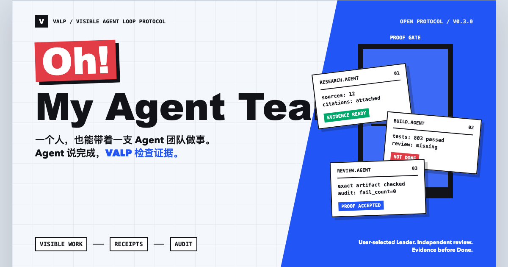
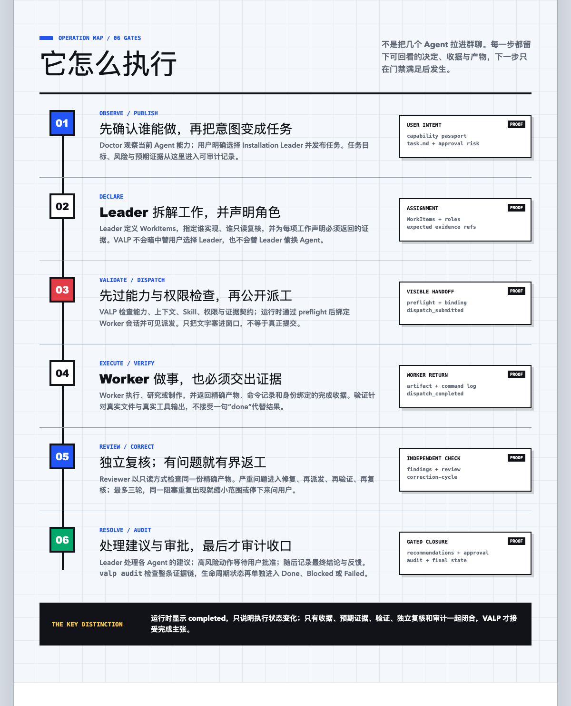

# Oh! My Agent Teams

## 让一个人，也能带着一支 Agent 团队做事

**Agent 说做完，VALP 要证据。**

你不需要先成立一间大公司，也不需要先部署十个 Agent。

从一台 Windows、macOS 或 Linux 电脑、两个 Agent 和一个小任务开始：

- 一个 Agent 负责执行；
- 一个 Agent 负责检查；
- VALP 负责确认这件事是否真的完成。

它不只是把 Agent 接在一起聊天，而是把派工、执行、产物、验证、审查和最终结论，
串成一条看得见的工作记录。

## 一个人的公司，也可以有自己的 Agent Team

你正在经营一个 OPC（One-Person Company，一人公司）：

研究 Agent 找市场资料，Builder Agent 写功能，测试 Agent 验证结果，Review Agent
找问题，而你只在真正重要的地方做决定。

你不用一直盯着每个窗口问“你到底做完了吗？”。VALP 会要求答案附带证据：

- 任务交给了谁？
- Agent 是否真的收到并执行？
- 产物放在哪里？
- 测试和验证是否完成？
- 有没有独立审查？
- 为什么这次可以进入 Done？

## 从个人试玩，到企业交付

对普通用户，你可以从两个 Agent 开始，亲手体验一次完整的协作流程。

对 OPC 创业者，你可以把研究、开发、内容、测试和运营工作拆给不同 Agent，自己保留
决策权。

对企业团队，你可以追踪不同 Agent 的分工、证据、审查与批准，知道一个交付为什么
可以完成，而不是只看到一句“Done”。

对 Runtime 和 Orchestrator 开发者，VALP 提供通用的 receipts、evidence、review
和 audit 语义，让不同模型、工具和 Agent 系统都能用同一种方式证明工作结果。

`Oh! My Agent Teams` 是让人想点进来的入口；`VALP` 是让人相信结果的证据与验收协议。

这两个身份都指向同一个问题：**执行成功，不等于交付完成。**

本页是中文入口，不是协议规范原文。若本页与 `SPEC.md`、`schemas/` 或
`valp audit` 行为冲突，以英文规范和机器可验证规则为准。

## 完整工作流

```text
Doctor 观察当前能力真值
  -> 用户明确选择 Installation Leader
  -> 用户发布任务
  -> Leader 声明 WorkItem 与角色到 Agent 的分工
  -> VALP 验证能力、上下文、Skill、权限与证据契约
  -> Runtime adapter 预检、绑定 Worker session 与可见派送
  -> 提交回执 -> Worker 执行 -> 完成回执 + 预期证据
  -> 验证 -> 独立审查 -> 有界修复/复审
  -> 处理 Agent 建议 -> 审批 gate -> 最终总结 + feedback
  -> valp audit -> PASS / WARN / FAIL
  -> 独立受 gate 约束的任务状态 -> Done / Blocked / Failed
  -> 可选的确定性单任务 Task Graph 投影
```





这张 ontology 引导图是解释图，不是 Runtime 或 release 证明。Ontology 只用于
路由与上下文投影，证据 ledger、独立审查与 `valp audit` 才是权威；Task Graph 只是下游只读投影。逐步语义见
[完整可见流程](docs/visual-flow.md)，可复核的真实 publish/dispatch 片段见
[公开过程证据](docs/case-studies/visible-dispatch-process-proof.md)。
也可查看[权威边界图](docs/assets/oh-my-agent-teams-authority-v0.3.0.png)、
[完成门禁图](docs/assets/oh-my-agent-teams-completion-v0.3.0.png)，或
[响应式完整说明](docs/oh-my-agent-teams.html)。

Task Graph 只读显示单个任务已有的 receipts、evidence 与 audit 摘要，不能生成
证据或改变审计结果。Neo4j 不在 v0.3.0 发布版中，也不是依赖；后续版本可以把它作为
可选 ontology 投影，但它只能读取既有 task ledger，永远不能成为路由、证据或
审计权威。

## 谁选 Agent

这个权力边界是固定的：

```text
Doctor 扫描每个 Agent surface/session 的能力护照
  -> 用户明确选择 Leader
  -> Leader 拆解任务并声明分工
  -> VALP 核对能力、模型、权限、上下文和证据边界
  -> 通过后才能 dispatch
```

Doctor 把 `official_claim`、`local_presence`、`live_callable` 和
`task_verified` 四层证据分开，并记录当前 Agent 实际接入的
model、provider、reasoning mode、session identity、Skills、MCP、权限、
上下文与限制。信息缺失就标记 `unknown`，不从 Agent 名称
猜模型。

VALP 可以拒绝一份不符合当前证据的 Leader 分工，但不能自己
选 Agent，也不能偷偷换人。`selected_agents` 仅是旧格式兼容字段，
表示“Leader 已声明的 Agents”，不表示“VALP 选出的 Agents”。

通用 VALP 任务在严格审计后把结果交回用户就结束。代码托管、
branch、push、pull request 或 merge 是用户与其 Agent 自己的后续工作，
不是通用协议的内建步骤。

## 版本入口与兼容性

当前正式发布版本为 `v0.3.0`，reference CLI package 为 `0.3.0`。该发布已完成
同提交验证、审查、合并、不可变 tag、GitHub Release 与发布后 smoke。版本历史与迁移
说明见 [版本与兼容性](docs/versioning-and-compatibility.md)。

## v0.3.0 已发布协议与参考 CLI

协议 wire/version target 是 `0.3.0`，当前 reference CLI package 是
`0.3.0`。[RFC 0001](docs/rfcs/0001-v0.3-installation-control-plane.md)
语义已纳入 `SPEC.md`、schemas 与 reference CLI，协议与 reference CLI 发布关卡已闭合。
请看 [v0.3 implementation guide](docs/v0.3-implementation.md)。

如果把 Prompt、Tools、Agents 看成 Software 3.0 的执行层，VALP 更像外面的
控制与验收层：它不负责让模型突然更聪明，而是让控制决策和 done claim
可以被检查。`0.2.0` 建立了单个任务的证据纪律；`0.3.0` 将它扩展到整个
安装级控制平面，使重启、故障、Provider 变化和协议升级仍然可追溯。

`0.3.0` core 包括：

- 由用户明确选择的 **Installation Leader**，并由确定性 core 和 leader
  epoch 约束，而不是把某个 Agent 永久写死为总协调者；
- 持久能力注册表，把 `official_claim`、`local_presence`、`live_callable`
  和 `task_verified` 四层证据分开保存；
- 严格的 message、可执行 state、claim-evidence、确定性 failure 和针对
  精确 artifact 的独立 review 契约；
- Provider-neutral plugin manifest 检查、显式 migration，以及包含负面与恢复
  场景的 conformance tests。

v0.3.0 发布证明的是本仓库所测试的协议核心和 reference CLI；不表示任何
Runtime、Provider、平台或生产部署已普遍得到证明。

对外声明按证据包分层：协议与 reference CLI 由 schemas、测试和 bundled audits
证明；自动 Full Mode 由具体 runtime adapter 的 dispatch/session/evidence/review
链证明；跨重启自动 continuation 需要完整到 `resume_consumed` 的
provider-consumed ledger，以及在 provider 已消费、VALP 未落盘 receipt 之间
注入崩溃后的重启对账与去重证据；生产托管与平台支持必须有独立运行环境证明。没有这些
证据时，不把它写成默认能力。

## 开源核心与商业交付边界

这个仓库公开的是 MIT 许可的开源核心：协议、reference CLI、schemas、adapter
契约、示例和测试。企业安装迁移、私有系统集成、托管运行、监控、合规审查、
培训和支持服务属于独立的商业交付层，不随本仓库打包，也不把客户数据、凭证、
本机控制根目录或部署密钥带进来。详细边界见
[Open core and commercial boundary](docs/open-source-commercial-boundary.md)。

如果你是一线 Forward-Deployed Engineer（FDE，前线部署工程师），先看[现场交付 walkthrough](docs/case-studies/fde-field-delivery.md)：
它演示如何预览并应用 Leader 声明的配置、做 route validation、查看 Task Graph
当前状态、补齐证据并交付可复核的 handoff。文档明确标出 synthetic/local/Manual
边界，不把配置成功或 runtime `completed` 写成生产证明。

UI/工作台属于生态层，不进入协议内核；其边界与权威来源见
[FDE workbench boundary](docs/fde-workbench-boundary.md)。

这里真正可推广的不是“VALP 内置 223 个 skill”。Skill 来自企业已经安装或接入的
Agent / Runtime 环境：Doctor 先扫描每个 Agent 实际可达的 skill；用户选择的
Leader 再拆解任务并分配 Worker；VALP 按工作项推荐 skill、过滤成每个 Worker
自己的 skill slice；Worker 先加载 control contract，再调用或明确跳过可达的
skill，并返回证据。完整流程见
[Skill 的发现、路由与 Worker 调用](docs/skill-recommendation.md)。

对企业可以这样说：**VALP 不要求你重新买一套 Agent 或 skill；它先盘点你已经
有的能力，再由 Leader 把任务分给合适的 Worker，让 Worker 调用自己确实可达的
skill，并把 dispatch、验证、审查和最终证据串起来。**

请把 [完整 RFC](docs/rfcs/0001-v0.3-installation-control-plane.md) 和
[当前证据矩阵](docs/project-status.md) 对照阅读：前者写已接受的协议契约，
后者写今天已经证明的实现与 Runtime 范围。

## 五分钟体验

不需要先安装 Runtime：

```bash
git clone https://github.com/wcqxgjy6d8-pixel/Visible-Agent-Loop-Protocol.git
cd Visible-Agent-Loop-Protocol
python -m pip install -r requirements-dev.txt
bin/valp audit examples/minimal-task
```

通过时你会看到：

```text
VALP audit: PASS
Summary: pass=14 warn=0 fail=0
```

再看 [Minimal audit demo](docs/minimal-audit-demo.md)，它会展示：
删掉 expected evidence 后，即使 receipt 说结果已提交，`valp audit` 也会失败。

## 它不是什么

VALP 不是：

- 一个托管平台；
- 一个模型集成方法；
- 一个固定绑定 HERDR 的私有工作流；
- 一个能自动证明所有 Agent 可靠的魔法层；
- 一个替用户选 Leader，或替 Leader 选 Agent 的调度器；
- 一个替代测试、代码审查、审批流程的工具。

HERDR 只是当前参考 Runtime。其他 Runtime 只要能导出同等的 receipts、
evidence、state mapping 和 audit 数据，也可以实现 VALP。

## 推荐阅读

1. [英文 README](README.md)
2. [协议规范 SPEC.md](SPEC.md)
3. [v0.3 Installation Control Plane RFC](docs/rfcs/0001-v0.3-installation-control-plane.md)
4. [中文注解](docs/zh-CN/README.md)
5. [When Agent "Done" Is Not Done](docs/when-agent-done-is-not-done.md)
6. [失败案例图鉴](docs/failure-gallery.md)
7. [Runtime adapter checklist](docs/adapter-checklist.md)
8. [社区参与说明](docs/community.md)
9. [开源核心与商业交付边界](docs/open-source-commercial-boundary.md)

当前讨论入口：

- [RFC: Phase 0 public evaluation](https://github.com/wcqxgjy6d8-pixel/Visible-Agent-Loop-Protocol/discussions/8)
- [Runtime adapter checklist feedback](https://github.com/wcqxgjy6d8-pixel/Visible-Agent-Loop-Protocol/discussions/9)

适合新贡献者的任务：

- [Run the adapter checklist against one runtime](https://github.com/wcqxgjy6d8-pixel/Visible-Agent-Loop-Protocol/issues/10)
- [Add one false-done case to the failure gallery](https://github.com/wcqxgjy6d8-pixel/Visible-Agent-Loop-Protocol/issues/11)
- [Improve the Pages demo for Agent done is not done](https://github.com/wcqxgjy6d8-pixel/Visible-Agent-Loop-Protocol/issues/12)

如果你要实现 Runtime adapter，优先读：

- [Runtime adapters](docs/runtime-adapters.md)
- [Adapter checklist](docs/adapter-checklist.md)
- [Dispatch receipts](docs/dispatch-receipts.md)
- [Correction cycle evidence](docs/correction-cycle.md)
