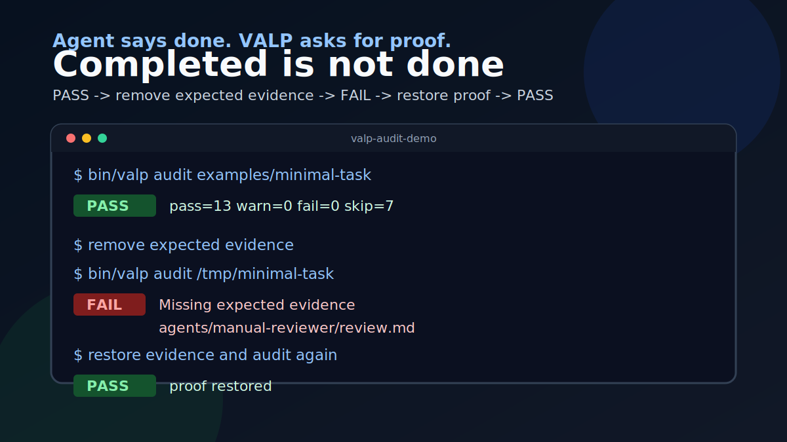

# Visible Agent Loop Protocol

Agent says done. VALP asks for proof.

VALP is an open protocol for visible, evidence-backed autonomous and
multi-agent work.

Start here:

- [Repository README](https://github.com/wcqxgjy6d8-pixel/Visible-Agent-Loop-Protocol/blob/main/README.md)
- [中文注解](zh-CN/README.md)
- [Protocol specification](https://github.com/wcqxgjy6d8-pixel/Visible-Agent-Loop-Protocol/blob/main/SPEC.md)
- [Proposed v0.3 installation control plane RFC](rfcs/0001-v0.3-installation-control-plane.md)
- [Twelve-layer N/I/P audit matrix](twelve-layer-nip-matrix.md)
- [Quickstart](quickstart.md)
- [Compound learning loop](compound-learning-loop.md)
- [When Agent "Done" Is Not Done](when-agent-done-is-not-done.md)
- [Minimal audit demo](minimal-audit-demo.md)
- [Visible dispatch process proof](case-studies/visible-dispatch-process-proof.md)
- [Failure gallery](failure-gallery.md)
- [Correction cycle evidence](correction-cycle.md)
- [Runtime adapter checklist](adapter-checklist.md)
- [Runtime adapters](runtime-adapters.md)
- [Community](community.md)
- [Maintainer governance](maintainer-governance.md)
- [Support](https://github.com/wcqxgjy6d8-pixel/Visible-Agent-Loop-Protocol/blob/main/SUPPORT.md)

The core idea is narrow: a runtime saying `completed` is not enough. VALP
completion requires automation policy, dispatch receipts, expected evidence,
verification/review, approval gates when needed, final synthesis, and
task-local learning feedback that points to proof.

VALP is currently `0.2.0`. It is an open protocol release plus a reference CLI,
not a hosted production platform.

## Proposed v0.3 Direction

The current release remains `0.2.0`. The
[v0.3 installation control plane RFC](rfcs/0001-v0.3-installation-control-plane.md)
targets `0.3.0-draft`. RFC 0001 remains incomplete and is not stable as a
whole. Its deterministic-wake subset is locally implemented and tested in the
reference core, schemas, and audit; the remaining installation-control-plane
work does not change current release or runtime-support claims.

The proposal extends VALP's evidence discipline from individual tasks to the
installation control plane: the user selects an Installation Leader;
capability truth remains separated into declared, present, callable, and
task-verified layers; messages, state, claims, failures, and review gain strict
machine contracts; and provider plugins stay outside the deterministic core.

Stable `0.3.0` would require implementation, schema and migration work,
negative/recovery conformance tests, and a real non-HERDR Full Mode end-to-end
proof. See the [project status matrix](project-status.md) for what is verified
today and the [RFC](rfcs/0001-v0.3-installation-control-plane.md) for the
proposed target.

First useful actions:

- Run `bin/valp audit examples/minimal-task` to inspect the evidence shape.
- Read [When Agent "Done" Is Not Done](when-agent-done-is-not-done.md) for the
  shortest public explanation.
- Run the [minimal audit demo](minimal-audit-demo.md) to see PASS -> FAIL ->
  PASS when expected evidence is removed and restored.
- Watch the [visible dispatch process proof](case-studies/visible-dispatch-process-proof.md)
  to see a real VALP/HERDR publish-and-dispatch run.
- Read the [failure gallery](failure-gallery.md) to see what VALP catches.
- Use the [adapter checklist](adapter-checklist.md) before claiming runtime
  compatibility.
- Share a real false-done failure case in GitHub Discussions.
- Request or prototype a runtime adapter only after the receipt/evidence gates
  are clear.

Active discussions:

- [RFC: Phase 0 public evaluation](https://github.com/wcqxgjy6d8-pixel/Visible-Agent-Loop-Protocol/discussions/8)
- [Runtime adapter checklist feedback](https://github.com/wcqxgjy6d8-pixel/Visible-Agent-Loop-Protocol/discussions/9)

Good first tasks:

- [Run the adapter checklist against one runtime](https://github.com/wcqxgjy6d8-pixel/Visible-Agent-Loop-Protocol/issues/10)
- [Add one false-done case to the failure gallery](https://github.com/wcqxgjy6d8-pixel/Visible-Agent-Loop-Protocol/issues/11)
- [Improve the Pages demo](https://github.com/wcqxgjy6d8-pixel/Visible-Agent-Loop-Protocol/issues/12)
