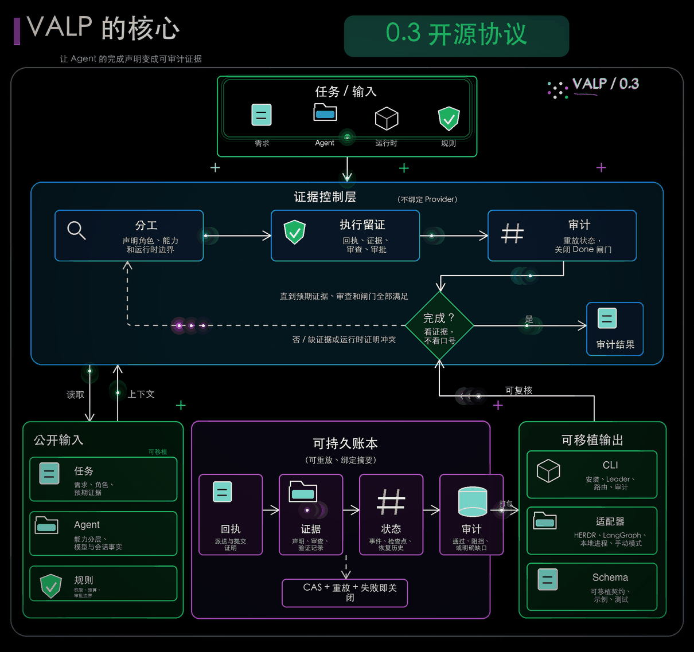

# Visible Agent Loop Protocol

Agent says done. VALP asks for proof.

VALP is an open protocol for visible, evidence-backed autonomous and
multi-agent work.

Start here:

- [Repository README](https://github.com/wcqxgjy6d8-pixel/Visible-Agent-Loop-Protocol/blob/main/README.md)
- [中文注解](zh-CN/README.md)
- [Protocol specification](https://github.com/wcqxgjy6d8-pixel/Visible-Agent-Loop-Protocol/blob/main/SPEC.md)
- [RFC 0002: layered architecture and D01-D19 traceability](rfcs/0002-layered-architecture.md)
- [v0.3.0 installation control plane](v0.3-implementation.md) and RFC
- [Versioning and compatibility](versioning-and-compatibility.md)
- [Twelve-layer N/I/P audit matrix](twelve-layer-nip-matrix.md)
- [Quickstart](quickstart.md)
- [Compound learning loop](compound-learning-loop.md)
- [When Agent "Done" Is Not Done](when-agent-done-is-not-done.md)
- [Minimal audit demo](minimal-audit-demo.md)
- [Visible dispatch process proof](case-studies/visible-dispatch-process-proof.md)
- [Failure gallery](failure-gallery.md)
- [Correction cycle evidence](correction-cycle.md)
- [Cost governance](cost-governance.md)
- [Open core and commercial boundary](open-source-commercial-boundary.md)
- [Skill discovery, routing, and Worker use](skill-recommendation.md)
- [Task Graph and Ontology boundary](task-graph.md)
- [Runtime adapter checklist](adapter-checklist.md)
- [Runtime adapters](runtime-adapters.md)
- [Layered runtime promotion readiness](layered-runtime-promotion-readiness.md)
- [Community](community.md)
- [Maintainer governance](maintainer-governance.md)
- [Support](https://github.com/wcqxgjy6d8-pixel/Visible-Agent-Loop-Protocol/blob/main/SUPPORT.md)

The core idea is narrow: a runtime saying `completed` is not enough. VALP
completion requires automation policy, dispatch receipts, expected evidence,
verification/review, approval gates when needed, final synthesis, and
task-local learning feedback that points to proof.

The complete authority and evidence path is: Doctor observes current
capabilities; the user selects the Installation Leader; the Leader declares
WorkItems and role-to-Agent assignments; VALP validates, binds Worker sessions,
and dispatches through an adapter; adapter-backed receipts record submission
and completion while Workers return expected evidence; verification, independent
review, recommendation resolution, approval, synthesis, feedback, and
`valp audit` close the task. The optional Task Graph then projects that one
task without changing it. See the [visual flow](visual-flow.md).

Neo4j is not part of this candidate. A future version may use it as an optional
ontology projection, but never as protocol truth, completion proof, or audit
authority.

VALP source currently defines the `0.3.0` protocol candidate and `0.3.0`
reference CLI. Stable status, external review, same-commit CI, merge, tag,
release, and post-release smoke remain pending. It is not a hosted production
platform.

## Protocol 0.3 Layered Architecture

The public RFC 0002 package comprises `SPEC.md`, this documentation index, the
project status page, and RFC 0002. It separates the Protocol `0.3` target into
five explicit layers: the Human Intent And
Authority Boundary, Reference System, pure Protocol Kernel, Adapter Boundary,
and External Runtime And Ecosystem. The
[specification](https://github.com/wcqxgjy6d8-pixel/Visible-Agent-Loop-Protocol/blob/main/SPEC.md#21-layered-architecture-and-kernel-boundary)
defines the normative ownership and proof boundaries; [RFC 0002](rfcs/0002-layered-architecture.md)
records public D01-D19 traceability and the staged implementation boundary.

Pure Protocol Kernel slices implement the closed Layer 02 Task transition
graph across its 13 truth statuses, with typed Events, terminal-state closure,
canonical identities, closed enums, State and `accepted` / `no_op` /
`rejected` Result contract, deterministic duplicate behavior, and ordered
`ReplayEntry(Event, EvidenceSet, accepted Result)` reducer re-execution with
complete canonical Result equality from a validated Genesis Root. It also
defines a structural Checkpoint Root contract that binds State, prefix, tail,
checkpoint-Result, and trust-policy identities. MVP-H authenticates that root
against an independently supplied trust policy and exact EvidenceSet, then
recomputes an ordered suffix through the same reducer while emitting zero
obligations. The machine contract and negative tests reject bare State roots,
impossible revision/history combinations, malformed or mismatched checkpoint
authentication, identity drift, suffix gaps/reordering/duplicates, and tampered
Results. A task-scoped Reference System `KernelStore` now adds canonical journal
and authenticated checkpoint persistence with strict restart recovery. The repository also
implements a pure v3 receipt-write reducer and digest-bound legacy/v2 migration
projection fixtures. A file-backed Reference System store performs cooperative
inter-process locking, canonical-prefix replay, CAS, atomic replacement, and
file plus directory synchronization. Its current evidence covers process-crash
recovery on the tested macOS/APFS host; it does not establish sudden-power-loss,
hostile-writer, or Windows parity. LangGraph, atomic HERDR, the file Queue, and
Manual Mode now have explicit task-local ABI 1.0 and canonical v3 adoption.
Queue terminal observation requires a real worker/run record, and Manual
revocation/adjudication is append-only and fail-closed. Adopted runtime waits
are bound to the durable Kernel graph across multiple dependency frontiers.
The Kernel control machine also implements authority-bound cancellation,
Interrupt/resume, and versioned Redirect. Cancellation of submitted or running
work creates deterministic Adapter obligations, while a task-local,
digest-chained effect ledger records pending, fulfilled, or blocked outcomes
against real proof without replaying effects.
This remains a bounded Kernel and Reference System implementation, not proof of
every external runtime, platform, or production deployment. No cross-platform
parity or release support is claimed. The protocol target is `0.3.0` and the
current reference CLI is `0.3.0`. See the [promotion-readiness matrix](layered-runtime-promotion-readiness.md)
for the exact boundary between local implementation evidence and live or
cross-platform gates.

## v0.3.0 Protocol Candidate And Reference CLI

The protocol target is `0.3.0` and the current reference CLI is `0.3.0`. The
[v0.3 installation control plane RFC](rfcs/0001-v0.3-installation-control-plane.md)
is incorporated into the reference CLI, schemas, and conformance runner.
Stable-version Done Criteria and release gates remain open; candidate status
does not broaden adapter, platform, or production-support claims.

The `0.3.0` implementation extends VALP's evidence discipline from individual tasks to the
installation control plane: the user selects an Installation Leader;
capability truth remains separated into declared, present, callable, and
task-verified layers; messages, state, claims, failures, and review gain strict
machine contracts; and provider plugins stay outside the deterministic core.

The first real non-HERDR end-to-end proof exists for the local LangGraph API
development runtime. That proof remains scoped to the tested adapter/runtime
pair. See the [project status matrix](project-status.md) for what is verified
today and the [RFC](rfcs/0001-v0.3-installation-control-plane.md) for the
accepted protocol contract.

First useful actions:

- Run `bin/valp audit examples/minimal-task` to inspect the evidence shape.
- Run `bin/valp graph examples/full-mode-task --format all` to render the
  evidence-linked user-facing Task Graph. It is a projection for inspection;
  `valp audit` remains the completion gate.
- Read [When Agent "Done" Is Not Done](when-agent-done-is-not-done.md) for the
  shortest public explanation.
- Run the [minimal audit demo](minimal-audit-demo.md) to see PASS -> FAIL ->
  PASS when expected evidence is removed and restored.
- Watch the [visible dispatch process proof](case-studies/visible-dispatch-process-proof.md)
  to see a real VALP/HERDR publish-and-dispatch run.
- Read the [failure gallery](failure-gallery.md) to see what VALP catches.
- Use the [adapter checklist](adapter-checklist.md) before claiming runtime
  compatibility.
- Share a real false-done failure case in GitHub Discussions.
- Request or prototype a runtime adapter only after the receipt/evidence gates
  are clear.

Active discussions:

- [RFC: Phase 0 public evaluation](https://github.com/wcqxgjy6d8-pixel/Visible-Agent-Loop-Protocol/discussions/8)
- [Runtime adapter checklist feedback](https://github.com/wcqxgjy6d8-pixel/Visible-Agent-Loop-Protocol/discussions/9)

Good first tasks:

- [Run the adapter checklist against one runtime](https://github.com/wcqxgjy6d8-pixel/Visible-Agent-Loop-Protocol/issues/10)
- [Add one false-done case to the failure gallery](https://github.com/wcqxgjy6d8-pixel/Visible-Agent-Loop-Protocol/issues/11)
- [Improve the Pages demo](https://github.com/wcqxgjy6d8-pixel/Visible-Agent-Loop-Protocol/issues/12)
