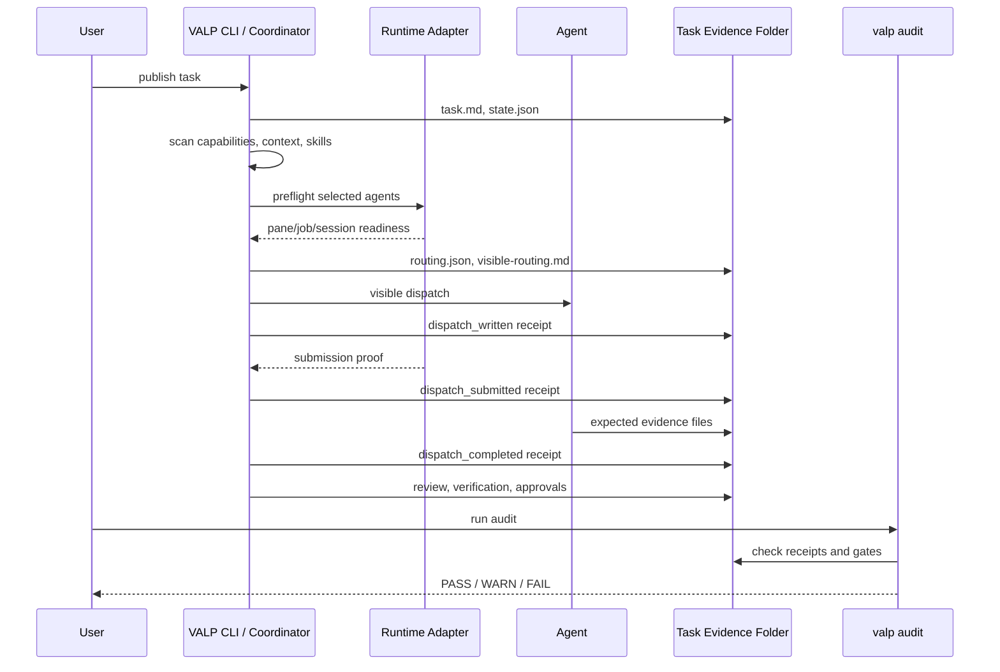

# Visual Flow

VALP is easiest to inspect as a receipt-and-evidence timeline. The runtime may
be HERDR, a queue, a hosted platform, a remote host, or a manual handoff, but
the task is not done until the expected evidence and review gates exist.



## Evidence Map

```text
.herdr-loop/tasks/<task-id>/
  task.md
  state.json
  routing.json
  visible-routing.md
  dispatch-receipts.jsonl
  agents/<agent>/dispatch.md
  agents/<agent>/<expected-output>.md
  evidence/verification.md
  final-synthesis.md
```

## Reading The Timeline

- `dispatch_written` means the task file exists and was surfaced.
- `dispatch_inserted` means text entered a runtime surface, but may not have
  been submitted.
- `dispatch_submitted` requires runtime submission proof.
- `dispatch_completed` requires expected evidence after submission proof.
- A runtime "completed" state is advisory until VALP evidence gates pass.
